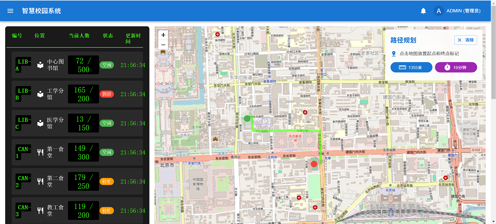

# 智慧校园系统

基于WebGIS的智慧校园系统设计与开发，为校园提供地图可视化、建筑管理、用户管理等功能。



## 项目特点

- 前后端分离架构，前端使用React，后端使用Node.js
- 基于本地JSON文件的数据存储，无需安装配置数据库
- 响应式设计，支持多种设备访问
- WebGIS地图可视化，便于校园导航与设施查询
- 完善的用户认证和权限管理
- 支持建筑物管理与地理位置搜索

## 技术栈

### 前端
- React + TypeScript
- Material UI 组件库
- Axios 网络请求
- WebGIS 地图组件

### 后端
- Node.js + Express
- JWT 身份验证
- 本地JSON文件数据存储
- RESTful API 设计

## 系统功能

- **用户管理**：用户注册、登录、权限管理
- **建筑管理**：添加、编辑、删除校园建筑
- **地图导航**：校园地图可视化与导航
- **任务系统**：校园任务创建与管理
- **公告管理**：校园公告发布与展示

## 系统特色

### 本地数据存储
系统采用本地JSON文件存储数据，无需安装配置数据库，便于部署和迁移：
- 用户数据存储在 `server/data/users.json`
- 建筑数据存储在 `server/data/buildings.json`
- 任务数据存储在 `server/data/tasks.json`

### 用户角色与权限
- **管理员**：拥有系统所有权限，包括用户管理、建筑管理
- **教师**：可以创建和管理任务
- **学生**：可以查看地图和完成任务

## 安装与运行

### 环境要求
- Node.js 16.x 或更高版本
- npm 8.x 或更高版本

### 安装步骤

1. 克隆仓库
```
git clone https://github.com/yourusername/SmartCampusSystem.git
cd SmartCampusSystem
```

2. 安装依赖
```
# 安装后端依赖
cd server
npm install

# 安装前端依赖
cd ../client
npm install
```

3. 初始化管理员账户
```
cd ../server
node init/initAdmin.js
```
初始管理员账户信息：
- 用户名：admin
- 密码：admin123

4. 启动服务
```
# 启动后端服务（在server目录下）
npm start

# 启动前端服务（在client目录下）
cd ../client
npm start
```

5. 访问系统
在浏览器中打开 http://localhost:3000 访问系统

## 部署到其他机器

由于采用本地JSON文件存储数据，系统部署非常简便：

1. 复制整个项目目录到目标机器
2. 安装Node.js环境
3. 安装依赖
4. 启动服务

数据文件会自动在 `server/data` 目录中创建，也可以手动复制现有数据文件。

## 功能使用指南

### 1. 用户管理

管理员可以通过"用户管理"页面创建和管理用户：
- 添加新用户：点击"添加用户"按钮
- 编辑用户：点击用户列表中的编辑图标
- 删除用户：点击用户列表中的删除图标

### 2. 建筑管理

管理员可以通过"建筑管理"页面管理校园建筑：
- 添加建筑：点击"添加建筑"按钮，填写建筑信息
- 编辑建筑：点击建筑列表中的编辑图标
- 删除建筑：点击建筑列表中的删除图标

### 3. 地图导航

所有用户可以通过地图页面查看校园地图：
- 查看建筑：点击地图上的建筑图标
- 搜索建筑：使用搜索框查找建筑
- 查看建筑详情：点击建筑标记查看详细信息

### 4. 任务管理

教师和管理员可以创建和分配任务：
- 创建任务：点击任务页面右下角的"+"按钮
- 查看任务列表：访问"任务管理"页面
- 更新任务状态：点击任务卡片上的状态按钮

## 数据备份与恢复

系统所有数据存储在 `server/data` 目录下的JSON文件中：

1. 备份数据：只需复制 `server/data` 目录
2. 恢复数据：将备份的文件复制到新系统的 `server/data` 目录

## 注意事项

1. **安全性**：生产环境部署时，务必修改默认管理员密码
2. **性能**：本地JSON存储适合中小规模应用，大规模应用可能需考虑迁移至数据库
3. **并发处理**：当前实现不适合高并发环境
4. **地图配置**：根据实际校园地图更新地图配置文件

## 技术支持与贡献

如有问题或建议，请提交Issue或Pull Request。